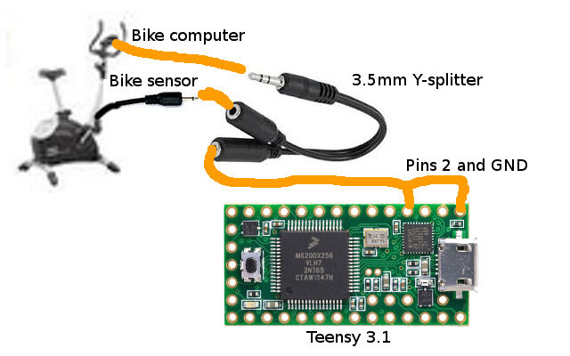

Turn your fitness or exercise bike into a USB Game Controller.

# Description

This project was created to convert the sensor data from a Keppler Paso 100 exercise bike to a game controller. The only function initially supported is converting the pedaling to forward Z axis momentum.

While the project was created for the Keppler Paso 100, it's reasonable to assume most bike sensors to have a similar interface and thus the code should be fairly compatible, or at least easy to port.

Quick demo of it in action is available at [http://www.twitch.tv/lietu/c/6745600](http://www.twitch.tv/lietu/c/6745600)


# Prerequisites

 * Teensy (I used a 3.1, most should work except maybe LC version. Arduinos could be easy to port for [UnoJoy](https://github.com/AlanChatham/UnoJoy) supported devices)
 * Keppler Paso 100 exercise bike (probably others with a similar 3.5mm jack for sensor are super easy to get working with this as well, I'd assume most sensors send a similar signal)
 * Some basic soldering skills, and very basic supplies.
 * Arduino software: [http://www.arduino.cc/en/Main/Software](http://www.arduino.cc/en/Main/Software)
 * Teensyduino add-on to the Arduino software (not if using an Arduino): [https://www.pjrc.com/teensy/teensyduino.html](https://www.pjrc.com/teensy/teensyduino.html)


# Cabling

The Keppler Paso 100 sensor provides data via a 3.5mm TS jack (looks like a mono 3.5mm audio jack), so I used a 3.5mm Y-splitter and hooked it to the normal input port of the exercise bike's computer. The other end of the Y-splitter I connected to a 3.5mm cable, the other end of which I stripped and hooked to the Teensy.



Specifically the connections are as follows:
 - Bike sensor 3.5mm <-> Y -splitter
 - Y -splitter to bike computer
 - Y -splitter to 3.5mm audio cable
 - 3.5mm audio cable to Teensy pins GND and 2

The Y-splitter is of course completely optional, if you don't care about the exercise bike computer itself. Then just wire the bike sensor directly to pins GND and 2.

If you have a stereo 3.5mm audio cable, 2 of the leads are going to be short circuit together via the Y-splitter, you can check which two with your multimeter.

The pins are configurable in code, just read the comments at the top of `ebjoy/ebjoy.ino`.

# Programming the device

Make sure you've got the software installed as specified in *Prerequisites* before this. Also you might want to make sure your cabling is done so you can test the result after this. The Teensy also needs to be plugged in to your USB port for this.

Download this project's source code to your computer, and open the `ebjoy/ebjoy.ino` file on your Arduino software. 

In the `Tools` -menu, choose the board correctly (Teensy 3.1 for me), then set the USB type to `Serial + Keyboard + Mouse + Joystick`. You might want to set the CPU speed to the speed your Teensy is rated for instead of the default (?) overclocked speed, we won't need a lot of CPU time.

Click on the "Verify" button or use the `Sketch -> Verify / Compile` -menu option.

If using a Teensy, that should open up a dialog with the Teensy programmer on it. All you should need to do is press on the button on your Teensy to inidiate the upload. It might take a few tries to get it working right.

On an Arduino you'd want to click on the "Upload" button on the Arduino software, or the `File -> Upload` -menu option.


# Confirming that it works

First test is making sure that the Teensy can read your sensor output. Make sure your cabling is done, connections are good, and the program has been uploaded. Also Teensy needs to be plugged in to your USB port for this.

In the Arduino IDE select `Tools -> Serial Monitor` -menu option. You should start seeing RPM and Joystick Z values reported from the device. If not, there's something wrong with the device, or your settings. Do NOT continue unless you see something similar to:

```
0 RPM
Joystick Z: 512
0 RPM
Joystick Z: 512
```

Now you can test if the Teensy can read the input from your sensor. Go to your bike, and turn the pedals at least several full rotations within a couple of seconds.

If the RPM and Joystick Z figures rise, the sensor input can be read. If the RPM shown on the Serial Monitor does not roughly match what you see on the bike, you need to tune the code somehow.

If the previous check seemed ok, you can now open up your Windows game controller properties. On Windows 7 you can go to *Control Panel* and use the search for `game controller` to find the *Set up USB game controllers* -entry.

If you click on that, you should see a dialog with the title *Game Controllers* and a `Serial/Keyboard/Mouse/Joystick` -controller with status *OK*. Click on that, and then *Properties*. On the *Test* -tab, you should see all the axes, buttons, etc. the joystick emulation supports. Look at the *Z Axis* -bar and try pedaling. Within a few rotations you should see it starting to rise up, the faster you pedal the further it should rise.

If all of the above is true, you now have an exercise bike game controller. Congratulations! If not, you'll have to do debugging, and relevant fixes. Start by checking your cabling.

Pull requests that do NOT break original support, but add optional support for other devices/sensors/whatever are highly appreciated.


# Other sensors

What the code does, it waits for the sensor pins to close. The Keppler Paso 100 connects the two sensor leads together every full rotation. To test for compatibilty connect your multimeter to your exercise bike's sensor, set it on the connectivity beeper test mode. If it beeps once per full rotation of the pedals, your sensor is likely compatible with this project as it is.

If not, you'll have to replace the `EBInput` -class with something that understands the sensor you have. Good luck that, and please do send a pull request once it works!


# Arduino issues on Windows

This may or may not be relevent to Teensy boards, but if you use Arduinos then you'll likely bump into this issue.

Apparently some idiot decided to push a new driver through Windows Update that breaks compatibility with some Arduinos. If you find your Arduino not registering in the Arduino IDE and showing up as "FT232R USB UART Driver" with an exclamation mark in the device manager, check out this video: [https://www.youtube.com/watch?v=SPdSKT6KdF8](https://www.youtube.com/watch?v=SPdSKT6KdF8)


# Credits

Thanks to Dumle29 on #Arduino @ Freenode for the help with getting the sensor reading in.
